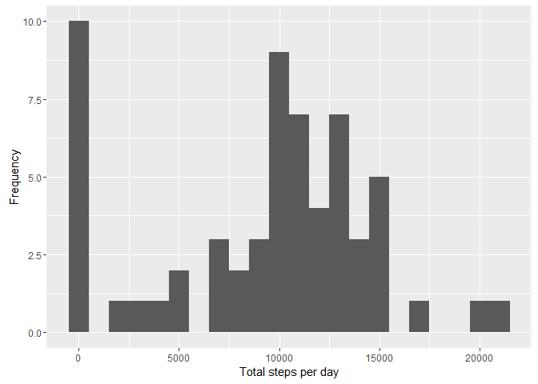
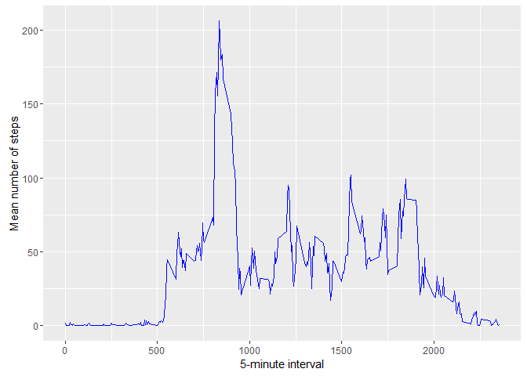
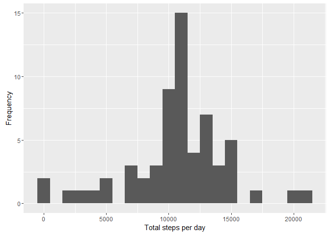
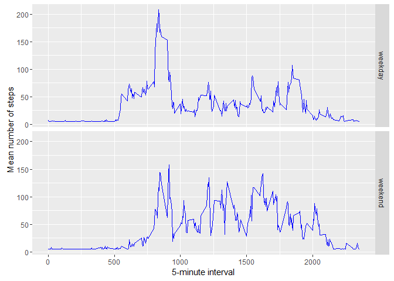

# Reproducible Research: Peer Assessment 1

This analysis makes use of data from a personal activity monitoring
device. This device collects data at 5 minute intervals through out the
day. The data consists of two months of data from an anonymous
individual collected during the months of October and November, 2012
and include the number of steps taken in 5 minute intervals each day.


## Loading and preprocessing the data

The dataset is stored in a comma-separated-value (CSV) file and there
are a total of 17,568 observations in this dataset.

####Initiate libraries:

```r
library(dplyr)
```

```
## 
## Attaching package: 'dplyr'
```

```
## The following objects are masked from 'package:stats':
## 
##     filter, lag
```

```
## The following objects are masked from 'package:base':
## 
##     intersect, setdiff, setequal, union
```

```r
library(ggplot2)
library(lattice)
```

####Reading data and transforming date to approrpiate format. This will also create a new factor for weekend or weekday.

```r
activity <- data.frame(read.csv(unz("activity.zip", "activity.csv")))
activity$date <- as.POSIXct(activity$date, format="%Y-%m-%d")
activity$datetype <-  ifelse(as.POSIXlt(activity$date)$wday %in% c(0,6), 'weekend', 'weekday')
```

## What is mean total number of steps taken per day?
####Calculate the sum of steps per day:

```r
dailysteps <- tapply(activity$steps, activity$date, sum, na.rm = TRUE)
```

####Calculate mean and median steps per day.

```r
dailystepsmean <- mean(dailysteps)
dailystepsmedian <- median(dailysteps)
```
* Mean: 9354.2295082
* Median: 10395

###Histogram:

```r
qplot(dailysteps, xlab='Total steps per day', ylab='Frequency', binwidth=1000)
```

<!-- -->


## What is the average daily activity pattern?

####Calculate the mean :

```r
meanbyinterval <- aggregate(x=list(mean=activity$steps), by=list(interval=activity$interval), FUN=mean, na.rm=TRUE)
```

####Calculate the 5-minute interval with the greatest mean steps:

```r
max <- meanbyinterval[which(meanbyinterval$mean == max(meanbyinterval$mean)), 1]
```
* 5-minute interval with the mean greatest number of steps is 835

###Time series of interval and daily mean steps

```r
ggplot(data=meanbyinterval, aes(x=interval, y=mean)) +
  geom_line(color = "blue") +
  xlab("5-minute interval") +
  ylab("Mean number of steps") 
```

<!-- -->


## Imputing missing values

####Calculate the number of missing values:

```r
countna <- sum(is.na(activity$steps))
```
* Missing values: 2304

####Impute the mean steps into all intervals with missing step values:

```r
nas <- which(is.na(activity$steps))
meanfil <- rep(mean(activity$steps, na.rm=TRUE), times=length(nas))
reactivity <- activity
reactivity[nas, "steps"] <- meanfil
```

####Recalculate the sum of steps per day:

```r
redailysteps <- tapply(reactivity$steps, reactivity$date, sum, na.rm = TRUE)
```

####Recalculate mean and median steps per day:

```r
redailystepsmean <- mean(redailysteps)
redailystepsmedian <- median(redailysteps)
```
* Mean: 1.0766189\times 10^{4}
* Median: 1.0766189\times 10^{4}

###Histogram:

```r
qplot(redailysteps, xlab='Total steps per day', ylab='Frequency', binwidth=1000)
```

<!-- -->

The mean and median of the imputed dataset are significantly different from the original calculations. The mean and median are also equivalent in the imputed dataset. This also causes the data to have a distribution closer to a standard normal distribution.

## Are there differences in activity patterns between weekdays and weekends?

####Time series of 5-minute inverval and mean steps taken, weekend vs. weekday

```r
remeanbyinterval <- aggregate(steps ~ interval + datetype, data=reactivity, mean)
ggplot(remeanbyinterval, aes(interval, steps)) + 
    geom_line(color = "blue") + 
    facet_grid(datetype ~ .) +
    xlab("5-minute interval") + 
    ylab("Mean number of steps")
```

<!-- -->
